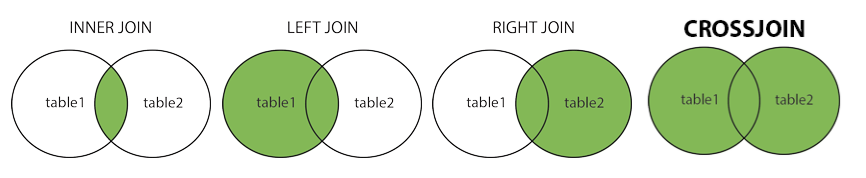

# Mysql Interview questions

1. ###  Describe **BLOB** in MySQL. What is it used for?

    **BLOB** or Binary Large Object can be used to store binary data in MySQL. Sometimes binary data like images need to be stored in SQL databases. For example you might want to store user photos along with other user details in the database table. Binary data of the user photo can be saved as a BLOB. By using BLOB, we will not require separate storage for images. BLOB helps in removing complexity and providing portability in such cases.

2. ### How are **VARCHAR** and **CHAR** different. Talk about cases where you will use one over other.

    Both **CHAR** and **VARCHAR** data types store characters up to specified length.

    * CHAR stores characters of fixed length while VARCHAR can store characters of variable length.
    * Storage and retrieval of data is different in CHAR and VARCHAR.
    * CHAR internally takes fixed space, and if stored character length is small, it is padded by trailing space characters. VARCHAR has 1 or 2 byte prefix along with stored characters.
    * CHAR has slightly better performance.
    * CHAR has memory allocation equivalent to the maximum size specified while VARCHAR has variable length memory allocation.

3. ### What is self referencing foreign key? Give an example.

    A foreign key which is stored in a table itself is called to be **self referencing foreign key.**

    For example consider an Employee database table. It has employee_id as primary key as well as a manager_id which is employee_id of his manager. If we create a foreign key constraint, as a manager is also an employee, manager_id will reference to empolyee_id in the same table. The Employee table with self referencing foreign key manager_id can be created using below statement.

    ```
    CREATE TABLE `Employee`( 
    `name` VARCHAR(25) NOT NULL, 
    `employee_id` CHAR(9) NOT NULL, 
    `manager_id` CHAR(9) NOT NULL, 
    `salary` decimal(10,2) NULL,  
    PRIMARY KEY(`employee_id`),
    FOREIGN KEY (manager_id) REFERENCES employee(employee_id) ON DELETE CASCADE
    );
    ```
4. ### What is the difference between Data Definition Language (DDL) and Data Manipulation Language (DML)?

    * Data definition language (DDL) commands are the commands which are used to define the database. CREATE, ALTER, DROP and TRUNCATE are some common DDL commands.

    * Data manipulation language (DML) commands are commands which are used for manipulation or modification of data. INSERT, UPDATE and DELETE are some common DML commands.

5. ### What is the difference between TRUNCATE and DELETE?

    **DELETE** is a Data Manipulation Language(DML) command. It can be used for deleting some specified rows from a table. DELETE command can be used with **WHERE** clause.

    **TRUNCATE** is a Data Definition Language(DDL) command. It deletes all the records of a particular table. **TRUNCATE** command is faster in comparison to **DELETE**. While **DELETE** command can be rolled back, **TRUNCATE** can not be rolled back in MySQL.

6. ### Both TIMESTAMP and DATETIME are used to store data and time. Explain difference between them and when should one be used?

    Both **TIMESTAMP** and **DATETIME** store date time in YYYY-MM-DD HH:MM:SS format. While **DATETIME** stores provided date time, TIMESTAMP first converts provided time to UTC while storing and then again converts it back to server time zone upon retrieval. So if you need to serve different users in different countries using same time data, **TIMESTAMP** facilitates it. **DATETIME** simply stores provided date time without making any time zone related conversion.

7. ### Explain GRANT command in MySQL
    When a new MySQL user is created, he requires certain privileges to perform various database operations. **GRANT** command grants certain privileges to the user. For example below statement grants permission to run **SELECT** and **INSERT** on **TABLE** customertable to user username@localhost.
    ```
    GRANT SELECT, INSERT ON customertable TO 'username'@'localhost'
    ```
8. ### Explain the use of FEDERATED tables in MySQL

    **FEDERATED** tables are tables through which MySQL provides a way to access database tables located in remote database servers. Actual physical data resides in remote machine but the table can be accessed like a local table. To use a federated table **ENGINE=FEDERATED** and a connection string containing user, remote hostname, port, schema and table name are provided in **CREATE TABLE** command something like below.

    ```
    CREATE TABLE table_fed (
    ... 
    )
    ENGINE=FEDERATED
    CONNECTION='mysql://user@remote_hostname:port/federated_schema/table';
    ```

9. ###  How can ENUM be used in MySQL. Give an example.

    ENUM can be used to set a column as enum type. ENUM in MySQL is string object which can take one of the permitted value. In example below, country column can have one of the three values provided:

    ```
    CREATE TABLE `Student`(
    `rollnumber` INT NOT NULL, 
    `name` VARCHAR(25) NOT NULL, 
    `country` ENUM('USA', 'UK', 'Australia'), 
    PRIMARY KEY(`rollnumber`));
    ```

10. ### What are different **TEXT** data types in MySQL. What is difference between **TEXT** and **VARCHAR**?

    Different text data types in **MySQL** include:
    * **TINYTEXT**,
    * **TEXT**,
    * **MEDIUMTEXT** and
    * **LONGTEXT**.

    These data types have different maximum size. While **TINYTEXT** can hold string up to 255 characters, **TEXT** can hold up to 65,535 characters, **MEDIUMTEXT** can hold up to 16,777,215 characters and **LONGTEXT** can hold up to 4,294,967,295 characters.

    **VARCHAR** is also a variable text data type with some difference. **VARCHAR** is stored inline in the database table while **TEXT** data types are stored elsewhere in storage with its pointer stored in the table. A prefix length is must for creating index on **TEXT** data types. **TEXT** columns do not support default values unlike **VARCHAR**.

11. ### What different stored objects are supported in MySQL?

    Different stored objects in MySQL include **VIEW, STORED PROCEDURE, STORED FUNCTION, TRIGGER, EVENT**.

    * **VIEW** - It is a virtual table based on a result set of a database query.
    * **STORED PROCEDURE** - It is a procedure stored in database which can be called using CALL statement. Stored procedure does not return a value.
    * **STORED FUNCTION** - It is like function calls which can contain logic. It returns a single value and can be called from another statement.
    * **TRIGGER** - Trigger is program which is associated with a database table which can be invoked before or after insert, delete or update operations.
    * **EVENT** - Event is used to run a program or set of commands at defined schedule.
  

12. ### What is Stored Function in MySQL. How are they different from Stored Procedure?

    Stored function is a stored complex logic which can be executed like a function call from any other statement. It returns a single value. It can be used to store business logic and formulas in database. Stored functions can even run **SELECT** command or table manipulation commands like **INSERT** and UPDATE.

    The most general difference between procedures and functions is that they are invoked differently and for different purposes:

    1. A procedure does not return a value. Instead, it is invoked with a CALL statement to perform an operation such as modifying a table or processing retrieved records.
    1. A function is invoked within an expression and returns a single value directly to the caller to be used in the expression.
    1. You cannot invoke a function with a CALL statement, nor can you invoke a procedure in an expression.

    e.g. SELECT get_foo(myColumn) FROM mytable is not valid if get_foo() is a procedure, but you can do that if get_foo() is a function. The price is that functions have more limitations than a procedure.

    ```
    CREATE PROCEDURE proc_name ([parameters])
    [characteristics]
    routine_body


    CREATE FUNCTION func_name ([parameters])
    RETURNS data_type       // diffrent
    [characteristics]
    routine_body
    ```
13. ### What is AUTO INCREMENT in MySQL? Explain with an example.

   * AUTO INCREMENT** in MySQL is used to automatically assign next unique integer value to a particular column.

   *  AUTO INCREMENT can be used to generate unique id for each inserted row without assigning a value to it. In MySQL, only columns which keep unique values like column with **UNIQUE CONSTRAINT** or **PRIMARY KEY** can be marked for **AUTO INCREMENT**. A table can have only one column marked for **AUTO INCREMENT**.

Code below can be used to mark studentid in Student table to auto increment. On adding a new Student without providing studentid, a unique student id with next available value is generated and assigned to the row.

```
CREATE TABLE `student`(`studentid` INT NOT NULL AUTO_INCREMENT,  `name` VARCHAR(25) NOT NULL, PRIMARY KEY(`studentid`));
```

14. ### What is the difference between commands create database and create schema in MySQL?

    Terms database and schema are synonymous in MySQL. Some other enterprise level databases like Oracle and Microsoft SQL server make distinction between database and schema. A MySQL developer can interchangeably use both the terms. For example a database called test can be created by using either of the CREATE statements below.

15. ### A multiple column index is created over firstName, lastName, city columns of a Customer table. Will this index be used for SELECT queries based on only first_name, only last_name or only city values?
    
    Multiple column index works on left most prefix of the indexed columns. It means the index will work on queries based on first_name only and index will not be used in queries based on last_name. To elaborate the point following queries will use the index.

```
SELECT * FROM CUSTOMER WHERE firstName='Smith';
SELECT * FROM CUSTOMER WHERE firstName='Smith' AND lastName='Jones';
SELECT * FROM CUSTOMER WHERE firstName='Smith' AND lastName='Jones' AND city='London';
```
The queries like below will not use the index.

```
SELECT * FROM CUSTOMER WHERE lastName='Jones' AND city='London';
SELECT * FROM CUSTOMER WHERE lastName='Jones';
SELECT * FROM CUSTOMER WHERE city='London';
```

16. ###  Provide an example of UPSERT logic using MySQL

## Problem
Write MySQL command to update a table with certain values but with an extra condition: if the row to update is not found you need to create a new entry.
## Answer

Use ON DUPLICATE KEY UPDATE to run a command which can do an INSERT and UPDATE if needed in a single statement.

For example if we have a User table with attributes userid, name and mobilenumber. Following statement will try to insert Alice to the User table. If a user with provided userid is already present in the table, the command will simply update the row.

```
INSERT INTO `User` (`userid`, `name`, `mobilenumber`) 
VALUES('11112227', 'Alice', '876876876') 
ON DUPLICATE KEY UPDATE name='Alice', mobilenumber='876876876';
```

17. ### What are differences between MyISAM and InnoDB database engines commonly used in MySQL?

    Row level locking, foreign key support and transacation support are main features which differentiate InnoDB from MyISAM.

* MyISAM was default storage engine before 5.5 while InnoDB is default storage engine from 5.5 and later versions.
* InnoDB is ACID compliant ensuring data integrity while MyISAM is not ACID compliant.
* COMMIT and ROLLBACK are supported by InnoDB.
* InnoDB has row level locking, which makes it faster in highly concurrent cases in comparison to MyISAM which has locking at table level. With row level locking multiple sessions can simultaneously write in a table.
* Foreign key constraint is supported only in InnoDB and not MyISAM. InnoDB is appropriate engine for payment related applications where transaction support becomes important.

18. ### What does OPTIMIZE TABLE command do in MySQL?
    A database table can be defragmented over the time. OPTIMIZE TABLE command can be executed to reorganize table data and index. OPTIMIZE TABLE command might be useful for tables which are frequently updated. It can help improve performance of I/O operations.

19. ### What is database engine or storage engine? Mention few storage engines supported by MySQL and their use.

    Database engines or storage engines are software programs which perform database operations like create, read, update and delete. Major storage engines supported by MySQL are InnoDB and MyISAM. Other storage engines supported by MySQL include MEMORY, CSV, FEDERATED, MERGE, ARCHIVE and BLACKHOLE storage engines.

    * InnoDB storage engine - default MySQL storage engine from version 5.5 and later. InnoDB is ACID compliant, provides transaction support and foreign key support.
    * MyISAM storage engine- default storage engine before 5.5. It is non-transactional.
    * MEMORY storage engine- it creates temporary database tables in memory.
    CSV storage engine - it uses csv file for storing data.
    * FEDERATED storage engine - helps access data physically located in remote database server using a query to local database server.
    * MERGE storage engine - can be used to merge more than one table with identical column data into one table.
    * ARCHIVE storage engine - uses zlib compression to store archived data using less space, does not support indexing.
    * BLACKHOLE storage engine - acts like a black hole, accepts data to store, does not store it and always returns empty. BLACKHOLE storage engine can be used in performance testing.

20. ### What is autocommit in MySQL? Can you run a transaction without disabling autocommit?

    In MySQL, if autocommit is disabled, any command you run will not be committed automatically, which means changes made through these commands will become permanent only if **COMMIT** is called. By default autocommit is enabled in MySQL, which means any change we make is part of a single transaction, commit is done automatically and it can not be rolled back.

    If autocommit is enabled you can call **START TRANSACTION** to start a transaction. **START TRANSACTION** command makes the changes temporary until either **COMMIT** or **ROLLBACK** is called to end the transaction.

21. ###  What is cursor used in MySQL? What are properties of MySQL cursor?

    Cursor is used in stored programs like stored procedure and stored functions. Cursor is a type of loop which can iterate through result of a SELECT query inside stored programs. Here are some properties of cursor in MySQL.

    Read-only - In MySQL, cursor is read only which means data of table cannot be updated using cursor.
    Non-scrollable - It is non-scrollable which means one can traverse in forward direction with one entry at a time without skipping entries or moving in reverse direction.
    Asensitive - It is asensitive which means cursor will not make temporary copy of the data rather use original data. One issue with cursor being asensitive is that if some other process changes the data while cursor is using it, result might not be predictable

22. ### Which partitioning types does MySQL support?

    MySQL supports range partitioning, list partitioning, hash partitioning and key partitioning.

    * **Range partitioning** - rows are partitioned based on a certain range of column value.
    * **List partitioning** - rows are partitioned based on if column value is same as value provided in a list.
    * **Hash partitioning** - rows are partitioned based on hash of column value. Hash partitioning provides a more even partitioning. Hash is computed based on user defined hash function.
    * **Key partitioning** - rows are partitioned based on a hashing function provided by MySQL like MD5 hash.

23. ### How many tables can a trigger associate to in MySQL? Can a trigger be associated to a view?

    A trigger in MySQL can be associated to a permanent table. It can not be associated to more than one table. Also a trigger cannot be associated to temporary table or view.

24. ### what do ddl dml and dcl stand
    
    **DDL**

    **DDL** is short name of Data Definition Language, which deals with database schemas and descriptions, of how the data should reside in the database.

    * **CREATE** - to create a database and its objects like (table, index, views, store procedure, function, and triggers)
    * **ALTER** - alters the structure of the existing database
    **DROP** - delete objects from the database
    * **TRUNCATE** - remove all records from a table, including all spaces allocated for the records are removed
    * **COMMENT** - add comments to the data dictionary
    * **RENAME** - rename an object

    **DML**

    DML is short name of Data Manipulation Language which deals with data manipulation and includes most common SQL statements such SELECT, INSERT, UPDATE, DELETE, etc., and it is used to store, modify, retrieve, delete and update data in a database.

    * **SELECT** - retrieve data from a database
    * **INSERT** - insert data into a table
    * **UPDATE** - updates existing data within a table
    * **DELETE** - Delete all records from a database table
    * **MERGE** - UPSERT operation (insert or update)
    * **CALL** - call a PL/SQL or Java subprogram
    * **EXPLAIN PLAN** - interpretation of the data access path
    * **LOCK TABLE** - concurrency Control

    **DCL**
    
    **DCL** is short name of Data Control Language which includes commands such as GRANT and mostly concerned with rights, permissions and other controls of the database system.

    * **GRANT** - allow users access privileges to the database
    * **REVOKE** - withdraw users access privileges given by using the GRANT command

    **TCL**

    **TCL** is short name of Transaction Control Language which deals with a transaction within a database.

    * **COMMIT** - commits a Transaction
    * **ROLLBACK** - rollback a transaction in case of any error occurs
    * **SAVEPOINT** - to rollback the transaction making points within groups
    * **SET TRANSACTION** - specify characteristics of the transaction

25. ### Explain MySql joins

    A JOIN clause is used to combine rows from two or more tables, based on a related column between them.

    Supported Types of Joins in MySQL

    * **INNER JOIN** - Returns records that have matching values in both tables    
    * **LEFT JOIN** -   Returns all records from the left table, and the matched records from the right table    
    * **RIGHT JOIN**- Returns all records from the right table, and the matched records from the left table    
    * **CROSS JOIN**- Returns all records from both tables
    

26. ### What is Primary Key?

    The primary key is a unique or non-null key that uniquely identifies every record in that table or relation. The primary key column cannot store duplicate values that mean primary key column values are always unique. It is also called a minimal super key; therefore, we cannot specify more than one primary key in any relationship. A primary key column of one table can be referenced by a foreign key column of another table.

    The following are the essential primary key features:

    * The primary key column cannot contain duplicate values.
    * The primary key implements the entity integrity of the table.
    * A table cannot have more than one primary key column.
    * We can make the primary key from one or more table fields.
    * The primary key column should have NOT NULL constraints.

27. ### What is a Unique Key?

    The unique key is a single column or combination of columns in a table to uniquely identify database records. A unique key prevents from storing duplicate values in the column. A table can contain multiple unique key columns, unlike a primary key column. This key is similar to the primary key, except that one NULL value can be stored in the unique key column. The unique key is also called unique constraints and can be referenced by another table's foreign key.

    The following are the essential unique key features:

    * We can construct the unique key from one or more table fields.
    * A table can define multiple unique key columns.
    * By default, a unique key is in non-clustered unique indexes.
    * The unique constraint column can store NULL value, but only one NULL is allowed null per column.
    * The foreign key can reference the unique constraint in preserving the uniqueness of a table.

28. ### differences between Primary and Unique Key

    The following points explain the key differences between primary and candidate keys:

    * A primary key can constitute one or more fields of a table to identify records in a table uniquely. On the other hand, a unique key prevents two rows from having duplicate entries in a column.
    * A table cannot have more than one primary key in a relational database, while there can be multiple unique keys per table.
    * A primary key column cannot contain NULL values, whereas a unique key can have NULL values, but only one NULL is allowed in a table.
    * A primary key should be unique, but a unique key cannot necessarily be the primary key.
    * The primary key by default is a clustered index where data is physically organized in the sequential index. In contrast, the unique key is a unique non-clustered index.
    * The primary key implements entity integrity, whereas the unique key enforces unique data.